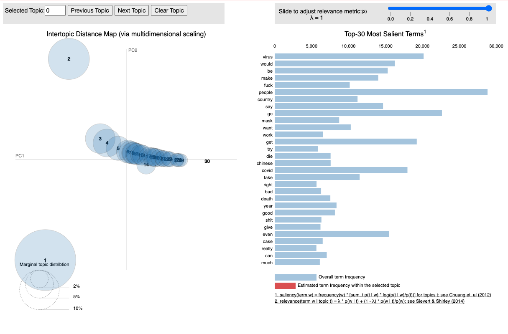

# IDP Project 

Author: Andrew Ellul - M.Sc Informatik - Technische Universität München

This repository is a collection of web-scraping scripts for the analysis of the online forums Reddit, 4Chan and 8Kun. The scraped data is not publically available via this repository, but can be shared on request.

#### Contents

* 1 - Code

  * 1A - Reddit Scraper via PRAW API
  * 1B - 4Chan Scraper via 4Chan API
  * 1C - 8Kun via HTML scraping

  * 1D - 4Chan Archive Scraper via HTML Scraping
  * 1E - HTML Conversion scripts

* 2 - Data

  * 2A - Exploratory Data Science
  * 2B - Further Work

* 3 - Conclusion and Learnings

# 1 - Code 

To acquire data from these platforms, various options were considered. In some cases, APIs were available, in others where no alternative was found, HTML scraping was used. HTML scraping involves making a simple HTTP request, just as a browser would, and downloading the entire .HTML file. This is akin to visiting a website via the browser and saving the exact page that is returned (with ctrl+s).  In all cases the Python was used as the programming language.

One important thing to note is that for the 4Chan data, we needed to scrape the data twice. This is due to a quality issue with the 4Chan API that was initially used. The API places an internal limit on the amount of data it returns, for example, it does not return all comments of a particular post but only the last 10 replies. For this reason, part 1D is an extra step I took to enrich this data. I gather all the post IDs obtained from the API and to re-download all the complete and full posts from the 4chan archive.

#### Scrapers Input/Output

Before I go into detail on the scraper scripts themselves, I will provide a 'big-picture' overview of how everything worked from input to output. 

There is a scraper script per platform, that is responsible for gathering data from that platform. In general, these scripts take a list of subreddits or boards (in the case of 4chan and 8kun) as input and generate 2 files as output:

- A **json file** containing the scraped data - For reddit this is 1 file per subreddit, that is continually updated. For 4chan and 8kun, a new file is produce per scrape, and it all must be aggregated at the end
- A **log file** which is simply used for debugging in case something goes wrong. This is important, in the case that the API fails, or it becomes apparent after scraping the data that certain time periods are missing. Checking the logs can show if the calls to certain subreddits were successful. In some cases, API timeouts occur or HTML requests are denied, which is due to certain protections from bots that the websites themselves implement. The scripts all account for this and requests are made in a way to remain below these thresholds but sometimes these issues do still occur

Some of these scripts also have a config file (the reddit scraper), in which the user's credentials and desired subreddits must be placed. A template file is provided in the directory

#### Infrastructure

The scrapers request the lastest posts and comments from each platform, since it is not possible to download all historical data. In this case we were interested in collecting the latest incoming information, rather than accessing historic records. Once the web scraping starts, the script will collect  a certain amount of latest posts will collect e.g. all top 50 new posts in a subreddit. This number is adujstable, and should be based on the intervals between scrapes. It is important to note that running the script once will do one single scrape, of all boards / subreddits listed. Once the script has acquired the information from one subreddit, it will iterate through to the next subreddit until all subreddits have been visited. Once the list has been completed, the script will terminate. 

Due to this, the script needs to be run at regular intervals to continually gather the latest posts of a period of time (days, weeks, months). To automate the requests, I used a built-in Unix CLI scheduling tool called Cron. A Cron job is simply a command that tells the computer to do something (e.g. run a python script) at a certain time or at regular intervals. It is the standard tool for automating the running of scripts to perform tasks in the OS, not just web scraping. 

To ensure that this all worked uninterrupted, instead of runnning this all from my local machine, I deployed these scripts onto an Amazon AWS EC2 Linux instance, which I left running for the duration of the scrape. The files (data and log files) were also stored locally on the EC2 file system. Once the scraping period was completed, I downloaded all files onto my local machine using SFTP (a recommended tool for this is FileZilla - https://filezilla-project.org/)

## 1A - Reddit Scraper via PRAW API

***NOTE: In hindsight, it would have been much better to use the Pushshift.io API, this is a much simpler and more relevant API for our usecase. However, at the time of the project, I had decided on PRAW as it allowed for a more customized approach.***

This is a simple Reddit scraper that utilises the Reddit API via the Python PRAW wrapper and outputs a json file with the filtered response. Documentation for PRAW and its usage can be found here: https://praw.readthedocs.io/en/latest/

### Usage

The repository contains one scraper file:

* `reddit_scraper.py`

You must setup the `config.ini` file:
* Create a config.ini file (use the .template file provided) with your `client_id`, `client_secret` and `user_agent` information. This will be used to authenticate with Reddit. You need some sort of account to access the API this way.
* Add the desired subreddits to the .ini file subreddit list. The name must match the name in the Reddit URL after the /r/ tag

This script will output 1 file per subreddit and will *update* this file with each subsequent scrape. 

### Run

* Once the config.ini file is configured, simply run `python reddit_scraper.py` in the terminal with no arguments

### Notes

1. This method does not allow access to quarantined subreddits - PRAW has a method for this but it does not work
2. Reddit does not provide a mechanism to download ALL submissions from a subreddit. Therefore, we are only able to collect the top X amount of submissions (API caps at around 1000). This is configurable at your discretion, we chose to scrape 20 posts per 5 minutes, including all comments contained in those posts

### Scheduling and Logging 

This script is intended to be run with a scheduler, such as cron. Therefore, to aid debugging in case something goes wrong, the script logs each scrape. 

Logging is logged to `scraper_reddit.py.log` 

## 1B - 4Chan Scraper via 4Chan API

This is a simple 4chan scraper that utilises the 4chan API and outputs a json file with the filtered response. Documentation for the API and its usage can be found here: https://github.com/4chan/4chan-API/

### Usage 

The repository contains two files
* `4chan_catalog_scraper_simple.py`
* `4chan_catalog_scraper_custom.py`

#### Simple (this is just for reference/example)

The simple file is the most basic implementation needed to generate a response from the 4chan API. Run this script from the command-line to generate a JSON file containing the unfiltered response output. 

#### Custom (use this for scraping)

The custom file is intended to filter out unnecessary clutter from the response (e.g. image dimensions) and to for use by a scheduler (e.g. a cron job). This is the file that should be used for scraping, as the simple file is really just there for learning purposes.

This script will generate a new file each time is run, batching the files into a separate folder per month. The result will be a file under `4chan-data/YYYY-MM/YYYY-MM-DD_HH-MM-SS_board.json`

### Run

* (Running Custom Scraper) 
* Unlike the reddit scraper, we do not need a configuration file. There is no authentication needed, however we can only scrape one board at a time
* In the "Setup" section of the code, line 20, provide the board you wish to scrape: `board = 'pol'`
* run `py 4chan_catalog_scraper_custom.py` 

### Notes

* Only 1 board can be scraped at a time
* Contrary to the Reddit scraper, this creates a new file each time the sript is run
* For each thread, the API only returns the last 10 comments, in the case of older threads with hundreds of comments, this is obviously prolematic and one of the reasons that I decided to stop using the API for the second scrape.
* Although 4chan provides a list of thread objects, the relpies to each thread stored in the 'last_replies' JSON array are not exhaustive. Therefore, frequent scraping is required to ensure replies to threads are gathered as they are posted.

### Scheduling and Logging 

Logging is logged to `4chan_catalog_scraper_custom.log` 

To aid scheduling, the script will store each scrape `.json` file with a timestamp under a folder named with the year and month.

## 1C - 8Kun via HTML scraping

The 8kun scraper uses no APIs or libraries and scrapes simply from the raw HTML returned by 8kun.top. To do the scraping, we use the Python 'Beautiful Soup' Library - https://www.crummy.com/software/BeautifulSoup/bs4/doc/

The scraper does the following:
1. Iterates through pages 1 and 10 gathering post ids (it is often the case that not all comments are visible in the paginated mode hence we scrape comments in step 2)
2. Iterates through the post ids gathered, downloading and storing the entire HTML document returned, which is the unique page for that post containing all comments. E.g. https://8kun.top/pnd/res/701.html#701

The filenames and logging are the same as above.

### Usage

* Similar to the 4chan script, the only requirement is to define the image board to be scraped. This can be found in "Setup", line 29 `imageBoard = 'pnd'`
* The script then scrapes the first 10 pages of the board, iteratively visiting these pages and gathering comments.
* Since this is HTML scraping, we download the whole HTML file - this must later be processed and converted into usable JSON, where we extract the data we are interested and throw away 99% of the rest of the file

### Run

* run `py 8kun-scraper.py` 

### Notes

* I included a timeout method in the 8kun scraper (using signal.alarm) since 8kun sometimes randomly hangs or blocks the connection. This results in the scraper hanging on trying to download one specific post. After 60 seconds of waiting, that post html page will be abandoned and the next will be attempted. This is a rare occurrence and I have included a wait method between each request to reduce the risk of being blocked but it does still periodically occur.

### Scheduling and Logging 

Logging is logged to `4chan_catalog_scraper_custom.log` 

To aid scheduling, the script will store each scrape `.json` file with a timestamp under a folder named with the year and month.

## 1D - 4Chan Archive Scraper via HTML Scraping

As mentioned above, after the initial scrape via the 4chan API yieled unsatisfactory results. The issues were that the API of 4chan seemed to have provided extremely little in the way of content over the 8 week period (50Mb in total). The API for some reason provided only the top 10 most recent comments per post. 

However, it turns out that there exist archives / historical records of 4chan posts, whose URLs are structured and easily scrapable. So I wrote new web scrapers in python, this time directly scraping the HTML and downloading the actual web pages for the latest content.  These pages contained the entire post, including all the comments, so in retrospect, this was and still is the best method to collect data from 4chan. 

4chan's dedicated archive website can be found here: 

* https://archive.4plebs.org/
  * example archived post: https://archive.4plebs.org/pol/thread/263998273/#263998273

### Usage

* The purpose of this script was to augment and enrich the data scraped by the 1st 4Chan API scraper. This means that, this script needs the initial faulty data scraped between June and August, as it gathers the Ids from these files and then looks up the post Ids in the 4chan archive and subsequently downloads the whole post
* Unfortantely this script is not designed to arbitrarily scrape the archive, but it can certainly be adapted for that use-case

### Run

* Before running this script you must create a folder "fourChanData" within the same folder as the archive scraper script
* You must also have the inital 4chan API data files that were scraped stored somewhere on your local drive. This is defined in the script in line 31 e.g. `fourchanData = "~/IDP/research-data/4chan-data/"` In line 32 we use the same path but define the first folder `fourchanData = "~/IDP/research-data/4chan-data/2020-06"`
* For the dataset that I had at the time, with around 21,000 files, this script took many hours to run

### IMPORTANT NOTE

* I have tried running this again in June 2021 and it appears that the archive website is now blocking bots and scrapers. This means that this approach and script may no longer work in this way.

## 1E - HTML Conversion scripts

After scraping HTML some work must be done to:

1. Extract the meaningful data and metadata from the HTML structure
2. Convert this into a more data-science friendly format such as JSON or CSV
3. Remove duplicates 

Essentially we want to convert the .HTML files into one JSON file containing all the relevant data we want to work with, as shown below:

For each 4Chan and 8Kun there are 2 conversion script:

-  Script 1 - converts HTML to JSON
- Script 2 - Removes duplicates and builds a cleaner JSON structure for the data

### 8kun - Run

* Setup
  * Data: prepare a folder with the scraped HTML files. Folder name and path to the folder is defined by the variable on line 9 `eightKunDataDir = "8kun-data/"`
  * Ensure that the folder contains **only** the 8kun html files. If using a MacBook or OSX, there will usually be a hidden .DS_Store file. The must be removed (via the terminal, `rm .DS_Store`) . The script iterates through the files in the folder and attempts to parse them all as HTML files, it will break/throw an exception if an unexcpected file is found.
  * You also need to explicitly define the first file in the directory, line 10, `firstFile = "2020-06-11_15-00-40_pnd_551.html"`
* run `python 8kun-conversion_file_1.py`
* This outputs a file in the script directory, containing all 8kun data in json form: `8kun-scraped-threads-all.json`. However this json file contains duplicates and requires another pass, which is the purpose of `8kun-conversion_file_2.py`
* Now run `8kun-conversion_file_2.py`
* This outputs 2 files:
  * `8kun-unique-threads-all.json` - this is the main JSON file with all the 8kun data
  * `8kun-unique-threads-sample.json` - this file contains a few samples from the main file, and is intended to be small enough to open and view in a text editor. The purpose of this file is purely to allow the user to investigate the JSON structure manually and makes understanding the data easier. Since the size of the 'all' file is usually too large to be opened efficiently in a text editor such as Sublime

### 4Chan - Run

* The setup and running of the 4Chan conversion scripts is almost identical to 8Kun, however due to the the 4Chan archive now blocking all bots from accessing it (receiving an access-denied message from the archive), these conversion scripts are no longer helpful.

# 2 - Data

Here I present the results of the web scraping attempts, and some statistical information regarding the data collected.  The data collection period of the live web scraping (wave 1) was 11th June 2020 - 4th August 2020:

The cron jobs for Reddit, 4Chan and 8Kun ran at 24hr, 12hr and 12hr intervals respectively. 

Overall both the following amounts of data were collected during this period:

| Platform | Scraped Data                                       | Dataset after cleaning                                | Total Objects                                      |
| -------- | -------------------------------------------------- | ----------------------------------------------------- | -------------------------------------------------- |
| Reddit   | 8.83Gb                                             | n/a                                                   | n/a                                                |
| 4Chan    | Scrape 1: 56.6 Mb (API) \| Scrape 2: 7.51Gb (HTML) | Scrape 1: n/a (too small) \| Scrape 2: 466.9Mb (HTML) | 21,681 Unique Threads \| 2,266,232 Unique Comments |
| 8Kun     | Scrape 1: 2.47Gb (HTML)                            | Scrape 1: 18.1Mb (HTML)                               | 1,024 Unique Threads \| 41,319 Unique Comments     |

### Data Cleaning 

A number of steps were taken to clean the data which pimarily involved the work in section 1E, which was the most important, converting the HTML from 4Chan and 8Kun into JSON.

Additionally, before any exploratory data science activities were carried out, several standard NLP pre-processing steps were taken such as the removal of stop-words and lemmatization. This is discussed in the next section "2A - Exploratory Data Science". 

## 2A - Exploratory Data Science

The goal of this project was to understand the evolution of various forms of hatespeech online, in terms of their lingustic structure (new memes, vocabulary, narratives being created in discussions online). After scraping large volumes of data from various internet forums, we required a method to explore possible topics, keywords or leads to investigate further in the dataset.

For this, we utitlized un unsupservised machine learning method known as LDA Topic modelling using the 'gensim' package. As input data, I used the 4Chan dataset, using the comments as input, as the 4Chan dataset was the largest and richest in terms of content.

All analyses were done via jupyter notebooks.

### Pre-Processing

In order for topic modelling to be effective, we need to filter out as much noise from the data as possible  certain pre-processing steps are taken:

* the dataset is converted to lowercase
* stop words are filtered out
* punctuation is filtered out
* digits are removed
* email addresses are removed
* the data is lemmatized

Once the text data has been normalised, we need to break up the corpus from sentences into words. Each sentence is now split into a list of words.

### Results

As this is unsupervised learning, it involves an element of trial, error and adjustment. I experimented by adjusting the hyperparamters and found the best results were generated with the number of target topics set to 30.

The screenshot below shows a visualisation of the resulting topcics, with 3 distinct topic areas and good distribution between 1, 2 and the rest. 

Not all these topics are hate-speech related and indeed many of the 'good' topics shown in the graphs above are not relavant to our analysis of hate speech lexicon. However, investigating all the topic keywords further we do find that this yielded some interesting associated topics for further analysis.

So as a result, we see that indeed some interesting word associations in these topic models were discovered, such as:

* Topic 17 - "vaccine", "state", "police", "force", "election", "bill_gate"
* Topic 6 - "people", "corona", "government", "virus", "world", "order", "free", "evidence"

In light of these findings, I would say there exists a basis for further work an investigation of the dataset, to gain a more deeper understanding of these topics and the associated language around them.

## 2B - Further Work

The project's scope was greater than what was possible to achieve given the timeline and budget, especially considering the challenges and difficulties encountered with web scraping. Therefore, some ideas and initial work in these directions had to be put on hold, nevertheless I document these for future reference and further work.

### Google Perspective

The output of the webscraping resulted in vast amounts of textual data that contains both benign and neutral comments as well as hate-speech related content. Currently in this form, aside from crude methods such as filtering for expletives, we have no mechanism by which to evaluate the level of hate-speech contained within a comment or object. 

The Google Cloud platform contains an API known as 'Google Perspective' (https://www.perspectiveapi.com/) which is a service that allows users to send textual content, and receive a toxicity score for the content within the text. The API is powered by machine learning and does not simply look for trigger words but rates the overall sentiment of the input, in terms of agreeableness, aggression and also assess it terms of its levels of spam. 

Below are two examples of a neutral comment and a toxic comment from 4Chan and the scores / responses receved from the Perspective API.

Due to time, volume and budget constraints I was unable to deploy a solution that would enrich our dataset with toxicity scores. The API limits users to sending 1 request per second and is also a paid service. Having a dataset of 2 million comments for 4Chan alone meant that the cost in terms of time and financial resources would haveg gone beyond the scope of this project.

However this may be a good method to incorporate in future hate-speech related data science projects.

### Statistical Analyses

I also attemtped to perform some statical analyses on hate-speech trigger words to look at the frequency of term occurrence over time, using known hate speech nicknames listed below and python chartin libraries such as Matplotlib and Seaborn to generate the below visualisations.

However due to time constraints I was unable to invest the necessary time and effort in investigating prior research and making decisions based on empircal studies on what terms to look for and how best to run such statistical analyses. 

Such approaches would be well suited for further work once they are informed with the results of the topic modelling in section 2A.

## Conclusion and Learnings

Some of the take-aways from this project that I can share

* Web Scraping

  * HTML Scraping is the most reliable and simplest form of scraping and should be seen as the default solution when scraping internet forums. This is because of the WYSIWYG principle. Essentially what you see through the browser is what you receive as data. The risk that an API filters out certain data is bypassed. Additonally, HTML Scraping, when done properly, is less likely to run into threshold issues where only so many requests per second are allowed. This depends on the effectiveness of the infrastructure security policy of the website itself, but is usually quite high to allow for high traffic and is only really intended to guard against DDoS attacks. Whereas APIs can very easily have a built-in request threshold, serving only so many responses per second
  * APIs may be a quicker solution when writing code, but this may be a trade off where data integrity and service availability is sacrificed. APIs should be regarded with caution unless they have a proven record as being reliable (e.g. Twitter API)

* Data

  * Preprocessing and filtering decisions can have great consequences on the upstream results and later findings of Natural Language Processing projects. Such decisions must be recorded in detail and methods must be informed and chosen based on current emperical research.
  * LDA Topic modelling proved to be a useful first step in exploratory data analysis of a data set where one is not sure what one is looking for in terms of keywords and topics. It was comparatively easy to setup, there are many tutorials available online and the results proved useful, keeping in mind that unsupervised learning and clustering never produce clear, definite results and are only meant to serve as approximators. 

* Experience

  * The research process - most of the decisions and discussions at the start were informed by current research especially the idea to look for emerging hate speech terms in online forums during the covid pandemic, however as the deadline drew nearer it became harder due to pressure to continually inform all decisions with emperical research. Decisions such as what terms to filter by suffered as a result. 
  * The research scope - ambitious at the start but in hindsight the scope was far too broad for the size and budget of the project. I had not anticipated nor planned for any difficulties or things going wrong with the scraping or the dataset, which in turn consumed more and more time to fix. In the future, I will opt for a much much narrower topic, and expand that topic if necessary.

* For future projects

  * Key NLP methodology decisions should be defined at the start - it should be clear what kind of data we intend to gather, in what format, how we are going to clean it and evaluate it, with what methods, tools and libraries. 
  * The failure / success criteria should be evaluated not in a binary form (success or failure) but in terms of steps achieved. Many steps in this project were conducted, althought the final goal was not reached, useful code and a dataset were produced as a result
  * Finally, I would aim in the future to not 'look for something interesting' in the data in an explaratory manner as I did in this project but would instead aim to test a particular theory or hypothesis that is well and clearly defined at the start

  
