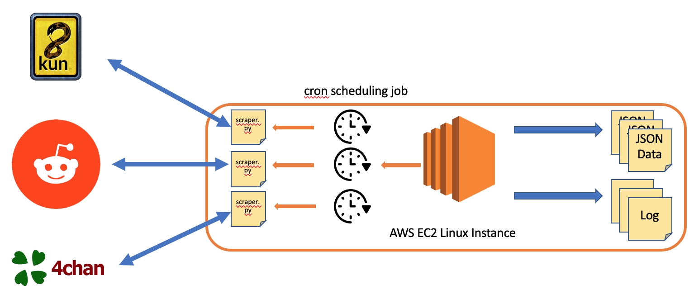
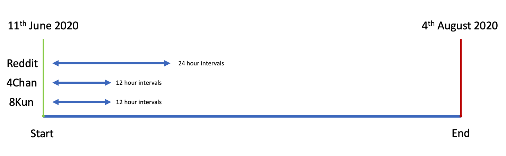
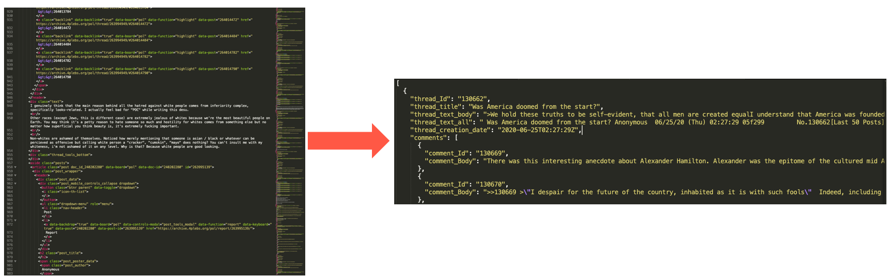
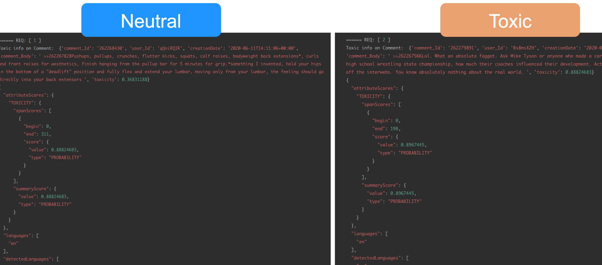
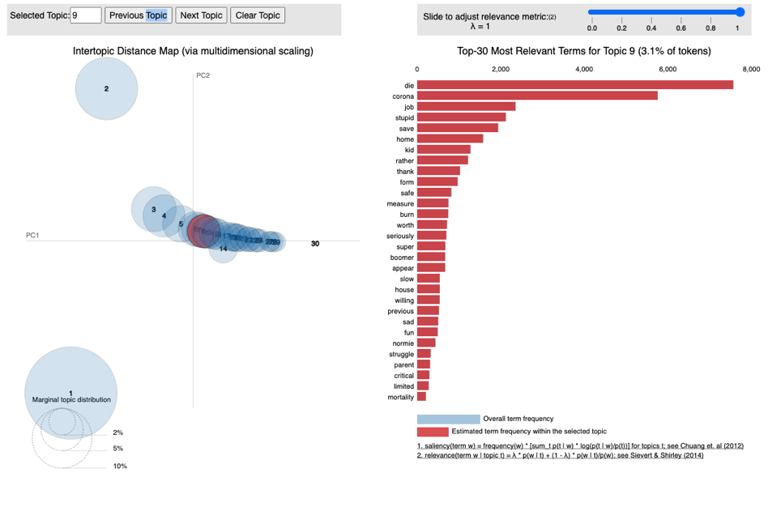
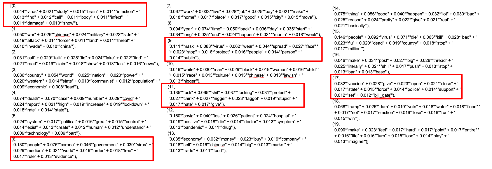
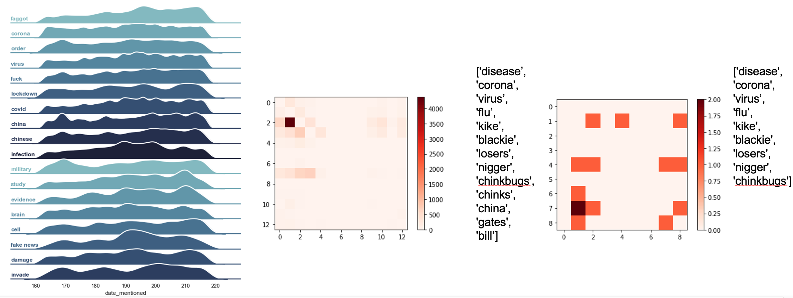

Questions:

- Do I add the notebooks? 

# IDP Project 

Author: Andrew Ellul - M.Sc Informatik - Technische Universität München

This repository is a collection of web-scraping scripts for the analysis of the online forums Reddit, 4Chan and 8Kun. The scraped data is not publically available via this repository, but can be shared on request.

#### Contents

* 1 - Code
  * First Wave: Live Web Scraping
    * 1A - Reddit Scraper via PRAW API
    * 1B - 4Chan Scraper via 4Chan API
    * 1C - 8Kun via HTML scraping
  * Second Wave: HTML Archive Scraping
    * 1D - (Wave 2) 4Chan Scraper via HTML Scraping
    * 1E - (Wave 2) 8Kun Scraper via HTML Scraping
* 2 - Data
  * 2A - Overview
  * 2B - Data Cleaning
  * 2C - Explortatory Data Science
* 3 - Conclusion and Learnings

# 1 - Code 

To acquire data from these platforms, various options were considered. In some cases, APIs were available, in others where no alternative was found, HTML scraping was used. HTML scraping involves making a simple HTTP request, just as a browser would, and downloading the entire .HTML file. This is akin to visiting a website via the browser and saving the exact page that is returned (with ctrl+s).  In all cases the Python was used as the programming language.

One important thing to note is that there were 2 "waves" of scraping that were conducted. Only 1 was planned, the second was needed due to issues with the results received from the APIs. So for the second wave, I reverted to pure HTML scraping for 4chan and 8kun and wrote new scripts for that.

## First Wave: Live Web Scraping 

#### Scrapers Input/Output

Before I go into detail on the scraper scripts themselves, I will provide a 'big-picture' overview of how everything worked from input to output. 

There is a scraper script per platform, that is responsible for gathering data from that platform. In general, these scripts take a list of subreddits or boards (in the case of 4chan and 8kun) as input and generate 2 files as output:

- A **json file** containing the scraped data 
- A **log file** which is simply used for debugging in case something goes wrong. This is important, in the case that the API fails, or it becomes apparent after scraping the data that certain time periods are missing. Checking the logs can show if the calls to certain subreddits were successful. In some cases, API timeouts occur or HTML requests are denied, which is due to certain protections from bots that the websites themselves implement. The scripts all account for this and requests are made in a way to remain below these thresholds but sometimes these issues do still occur

Some of these scripts also have a config file (the reddit scraper), in which the user's credentials and desired subreddits must be placed. A template file is provided in the directory

#### Infrastructure

The scrapers request the lastest posts and comments from each platform, since it is not possible to download all historical data. In this case we were interested in collecting the latest incoming information, rather than accessing historic records. Once the web scraping starts, the script will collect  a certain amount of latest posts will collect e.g. all top 50 new posts in a subreddit. This number is adujstable, and should be based on the intervals between scrapes. It is important to note that running the script once will do one single scrape, of all boards / subreddits listed. Once the script has acquired the information from one subreddit, it will iterate through to the next subreddit until all subreddits have been visited. Once the list has been completed, the script will terminate. 

Due to this, the script needs to be run at regular intervals to continually gather the latest posts of a period of time (days, weeks, months). To automate the requests, I used a built-in Unix scheduling tool called Cron. A Cron job is simply a command that tells the computer to do something (e.g. run a python script) at a certain time or at regular intervals. It is the standard tool for automating the running of scripts to perform tasks in the OS, not just web scraping. 

To ensure that this all worked uninterrupted, instead of runnning this all from my local machine, I deployed these scripts onto an Amazon AWS EC2 Linux instance, which I left running for the duration of the scrape. The files (data and log files) were also stored locally on the EC2 file system. Once the scraping period was completed, I downloaded all files onto my local machine using SFTP (a recommended tool for this is FileZilla - https://filezilla-project.org/)

## 1A - Reddit Scraper via PRAW API

***NOTE: In hindsight, it would have been much better to use the Pushshift.io API, this is a much simpler and more relevant API for our usecase. However, at the time of the project, I had decided on PRAW as it allowed for a more customized approach.***

This is a simple Reddit scraper that utilises the Reddit API via the Python PRAW wrapper and outputs a json file with the filtered response.

Documentation for PRAW and its usage can be found here: https://praw.readthedocs.io/en/latest/

### Usage

The repository contains one scraper file:

* `reddit_scraper.py`

You must setup the `config.ini` file:
* Create a config.ini file (use the .template file provided) with your `client_id`, `client_secret` and `user_agent` information. This will be used to authenticate with Reddit. You need some sort of account to access the API this way.
* Add the desired subreddits to the .ini file subreddit list. The name must match the name in the Reddit URL after the /r/ tag

This script will output 1 file per subreddit and will *update* this file with each subsequent scrape. 

### Run

* Once the config.ini file is configured, simply run `>py reddit_scraper.py` in the terminal with no arguments

### Notes

1. This method does not allow access to quarantined subreddits - PRAW has a method for this but it does not work
2. Reddit does not provide a mechanism to download ALL submissions from a subreddit. Therefore, we are only able to collect the top X amount of submissions (API caps at around 1000). This is configurable at your discretion, we chose to scrape 20 posts per 5 minutes, including all comments contained in those posts

### Scheduling and Logging 

This script is intended to be run with a scheduler, such as cron. Therefore, to aid debugging in case something goes wrong, the script logs each scrape. 

Logging is logged to `scraper_reddit.py.log` 

## 1B - 4Chan Scraper via 4Chan API

This is a simple 4chan scraper that utilises the 4chan API and outputs a json file with the filtered response.

Documentation for the API and its usage can be found here: https://github.com/4chan/4chan-API/

### Usage 

The repository contains two files
* `4chan_catalog_scraper_simple.py`
* `4chan_catalog_scraper_custom.py`

#### Simple (this is just for reference/example)

The simple file is the most basic implementation needed to generate a response from the 4chan API. Run this script from the command-line to generate a JSON file containing the unfiltered response output. 

#### Custom (use this for scraping)

The custom file is intended to filter out unnecessary clutter from the response (e.g. image dimensions) and to for use by a scheduler (e.g. a cron job). 

This script will generate a new file each time is run, batching the files into a separate folder per day. The result will be a file under `4chan-data/YYYY-MM/YYYY-MM-DD_HH-MM-SS_board.json`

### Run

* (Running Custom Scraper) 
* Unlike the reddit scraper, we do not need a configuration file. There is no authentication needed, however we can only scrape one board at a time
* In the "Setup" section of the code, line 20, provide the board you wish to scrape: `board = 'pol'`
* run `py 4chan_catalog_scraper_custom.py` 

### Notes

* Only 1 board can be scraped at a time
* Contrary to the Reddit scraper, this creates a new file each time the sript is run
* For each thread, the API only returns the last 10 comments, in the case of older threads with hundreds of comments, this is obviously prolematic and one of the reasons that I decided to stop using the API for the second scrape.
* Although 4chan provides a list of thread objects, the relpies to each thread stored in the 'last_replies' JSON array are not exhaustive. Therefore, frequent scraping is required to ensure replies to threads are gathered as they are posted.

### Scheduling and Logging 

Logging is logged to `4chan_catalog_scraper_custom.log` 

To aid scheduling, the script will store each scrape `.json` file with a timestamp under a folder named with the year and month.

## 1C - 8Kun via HTML scraping

The 8kun scraper uses no APIs or libraries and scrapes simply from the raw HTML returned by 8kun.top

The scraper does the following:
1. Iterates through pages 1 and 10 gathering post ids (it is often the case that not all comments are visible in the paginated mode hence we scrape comments in step 2)
2. Iterates through the post ids gathered, downloading and storing the entire HTML document returned, which is the unique page for that post containing all comments. E.g. https://8kun.top/pnd/res/701.html#701

The filenames and logging are the same as above.

### Libraries

* Python 'Beautiful Soup' Library - https://www.crummy.com/software/BeautifulSoup/bs4/doc/

### Usage

* Similar to the 4chan script, the only requirement is to define the image board to be scraped. This can be found in "Setup", line 29 `imageBoard = 'pnd'`
* The script then scrapes the first 10 pages of the board, iteratively visiting these pages and gathering comments.
* Since this is HTML scraping, we download the whole HTML file - this must later be processed and converted into usable JSON, where we extract the data we are interested and throw away 99% of the rest of the file

### Run

* run `py 8kun-scraper.py` 

### Notes

* I included a timeout method in the 8kun scraper (using signal.alarm) since 8kun sometimes randomly hangs or blocks the connection. This results in the scraper hanging on trying to download one specific post. After 60 seconds of waiting, that post html page will be abandoned and the next will be attempted. This is a rare occurrence and I have included a wait method between each request to reduce the risk of being blocked but it does still periodically occur.

### Scheduling and Logging 

Logging is logged to `4chan_catalog_scraper_custom.log` 

To aid scheduling, the script will store each scrape `.json` file with a timestamp under a folder named with the year and month.

## Second Wave: HTML Archive Scraping of 4Chan, 8Kun

The first wave was live, during the period of intended data collection, June - August 2020, the second was a retroactive scrape, which was done due to issues with the first wave. The issues were that the API of 4chan seemed to have provided extremely little in the way of content over the 8 week period (50Mb in total). The API for some reason provided only the top 10 most recent comments per post. Also for 8kun, the HTML scraping for similar reasons was not as successful, the HTML pages had a feature were only a subset of comments are shown, and the user had to click a "load more" link, to fetch more comments from the server. This meant that the scraped HTML pages were also lacking in completeness

However, it turns out that there exist archives / historical records of 4chan and 8kun posts, whose URLs are structured and easily scrapable. So I wrote new web scrapers in python, this time directly scraping the HTML and downloading the actual web pages for the latest content.  These pages contained the entire post, including all the comments, so in retrospect, this was and still is the best method to collect data from 4chan and 8kun. 

4chan had a dedicated archive website, whereas 8kun simply had a special immutable URL for each post with all its content. These can be found here: 

* https://archive.4plebs.org/
  * example archived post: https://archive.4plebs.org/pol/thread/263998273/#263998273
* 

For this reason, threre are 2 different types of web scrapers for 4chan and 8kun. 

## Conversion Scripts: HTML to JSON

### Run

* Setup
  * Data: prepare a folder with the scraped HTML files. Folder name and path to the folder is defined by the variable on line 9 `eightKunDataDir = "8kun-data/"`
  * Ensure that the folder contains **only** the 8kun html files. If using a MacBook or OSX, there will usually be a hidden .DS_Store file. The must be removed (via the terminal, `rm .DS_Store`) . The script iterates through the files in the folder and attempts to parse them all as HTML files, it will break/throw an exception if an unexcpected file is found.
  * You also need to explicitly define the first file in the directory, line 10, `firstFile = "2020-06-11_15-00-40_pnd_551.html"`
* run `python 8kun-conversion_file_1.py`
* This outputs a file in the script directory, containing all 8kun data in json form: 8kun-scraped-threads-all.json
* 

## 1D - (Wave 2) 4Chan Scraper via HTML Scraping

## 1E - (Wave 2) 8Kun Scraper via HTML Scraping

# 2 - Data

## 2A - Overview

Here I present the results of the web scraping attempts, and some statistical information regarding the data collected. 

The data collection period of the live web scraping (wave 1) was 11th June 2020 - 4th August 2020:

Overall both waves yielded the following numbers in data volume:

| Platform | Scraped Data                                       | Dataset after cleaning                                | Total Objects                                      |
| -------- | -------------------------------------------------- | ----------------------------------------------------- | -------------------------------------------------- |
| Reddit   | 8.83Gb                                             | n/a                                                   | n/a                                                |
| 4Chan    | Scrape 1: 56.6 Mb (API) \| Scrape 2: 7.51Gb (HTML) | Scrape 1: n/a (too small) \| Scrape 2: 466.9Mb (HTML) | 21,681 Unique Threads \| 2,266,232 Unique Comments |
| 8Kun     | Scrape 1: 2.47Gb (HTML)                            | Scrape 1: 18.1Mb (HTML)                               | 1,024 Unique Threads \| 41,319 Unique Comments     |

## 2B - Data Cleaning 

### Conversion Scripts

The conversion scripts are needed in order to convert the raw .HTML pages we scraped, into meaningful JSON data files. Almost all of the text and contents of the HTML files is thrown away, as we extract only specific metadata such as timestamps, usernames and comment bodies.

## 2C - Exploratory Data Science

### Google Perspective

### Topic Modelling

## Conclusion and Learnings

Some of the take-aways from this project that I can share

* Web Scraping

  * HTML Scraping is the most reliable and simplest form of scraping and should be seen as the default solution when scraping internet forums. This is because of the WYSIWYG principle. Essentially what you see through the browser is what you receive as data. The risk that an API filters out certain data is bypassed. Additonally, HTML Scraping, when done properly, is less likely to run into threshold issues where only so many requests per second are allowed. This depends on the effectiveness of the infrastructure security policy of the website itself, but is usually quite high to allow for high traffic and is only really intended to guard against DDoS attacks. Whereas APIs can very easily have a built-in request threshold, serving only so many responses per second
  * APIs may be a quicker solution when writing code, but this may be a trade off where data integrity and service availability is sacrificed. APIs should be regarded with caution unless they have a proven record as being reliable (e.g. Twitter API)

* Data

  * Decisions filtering
  * Topic modelling is useful

* •**Experience**

  •The research process

  •Research Scope – ambitious big ideas will likely be difficult to navigate and the workload will grow

  •Research Question – must be thoroughly defined and as narrow as possible

  •Data

  •Filtering decisions should be based on some sort of hypotheses or previous research not just filtering by keywords (e.g. how and where does one get those keywords?)

  •**Failures/Mistakes**

  •Project was too broad (too many platforms, too much data)

  •Research question was not well defined (look changes in hate speech over time)

  •Key decisions and methodology were not defined at the start

  •How do we filter for corona related comments from our dataset? What does the research suggest?

  •What type of analyses do we want to perform? 

  •What algorithms and what visualisations do we want to generate?

  •Finally, attempting to “look for something interesting” rather than testing a concrete theory
